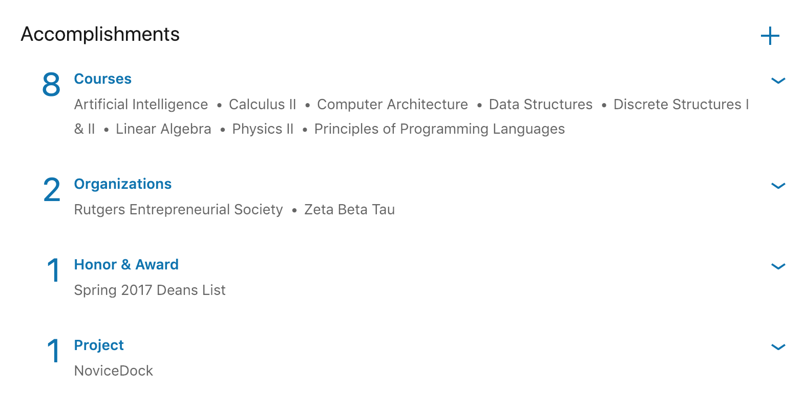
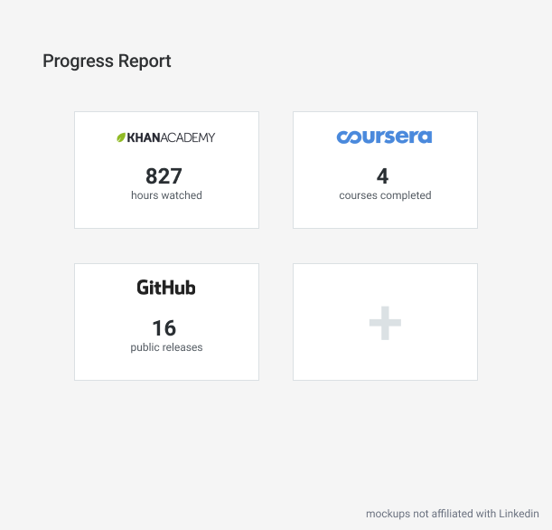
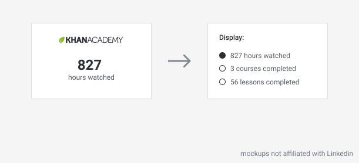
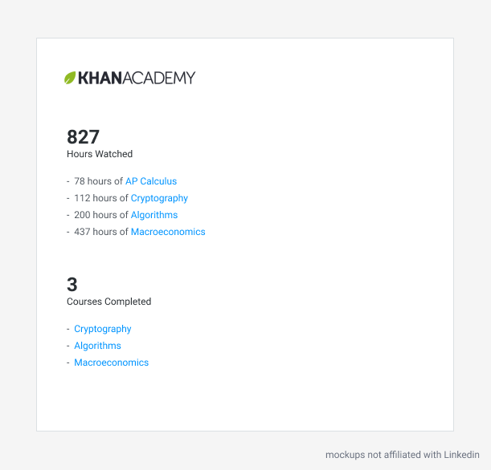

# Linkedin Online Education Connection

## Introduction

Although universities have a majority of the share when it comes to education, the internet gave room to other forms of education such as online video courses, nanodegrees, bootcamps, etc... It's fairly common that specialized jobs often require someone to learn new skills through self-education. For example, one may learn machine learning on [Coursera](https://www.coursera.org/) because it is not offered at their university, or they cannot afford university to begin with. Online education comes in all different shapes and sizes. It's difficult for individuals to keep track of what they learn and the certifications they receive. You can imagine how difficult it is for recruiters to find these qualities as well. Being that Linkedin is a place where people can show off their skills, and a place where recruiters can look for talent, there is opportunity for Linkedin to "plug in" with many companies such as [Coursera](https://www.coursera.org/), [Skillshare](https://www.skillshare.com/), [Udacity](https://www.udacity.com/) and [Standford Online](https://online.stanford.edu/courses).

## Problem

To discuss the problem, let's look at it from the perspective of aspiring software engineers and recruiters (one segment of the target audience). Currently there are thousands of students enrolled at universities studying some form of Computer Science. The first place most students apply are well-known companies like Microsoft, Google, and Apple. When recruiters go to respond to these applications, or look for talent in general, it's very difficult to distinguish quality candidates from non-quality candidates. It costs companies thousands of dollars in interviews to discover candidate qualities, and how "truthful" they are in their application.

Let's go into the "truthfulness" problem. It is said that [85% of applicants lie on their resume](https://www.inc.com/jt-odonnell/staggering-85-of-job-applicants-lying-on-resumes-.html). It's not very difficult for someone to lie about a course they took, or a certification they received. It can also get very complicated quickly when a student uses multiple education websites. It's difficult to keep track of all of this, meaning it's difficult for recruiters to verify find this information as well.

## Solution

Linkedin should consider a "plug and play" approach, where a student can connect their [Udacity](https://www.udacity.com/) account (and others) with their Linkedin account. The progress of the course the student is taking on Udacity would then be displayed on their Linkedin profile. 

If a recruiter sees a candidate has spent 1000 hours on Udacity or Khan Academy, it gives a lot more detail and substance to the skills of the candidate. Since this data is coming from (insert education company) database, we know it is (most likely) truthful.

This is the type of background data that recruiters need in order to distinguish future quality employees.

## Benefit to Linkedin and Online Education Companies

### Why should Linkedin plug into online education companies?

* Linkedin becomes an easier product for recruiters to use to distinguish candidates.
* Linkedin becomes more involved in the online education space.
* Users feel their education is being better represented on Linkedin.

### Why should online education companies plug into Linkedin

* The courses people take now become public on Linkedin user profiles. This is a great source of advertising.

## Other companies to "plug into"

Being that Github is a Microsoft-owned company, it makes sense that their may be potential to connect with Github's data. A recruiter in HR may not have a technological background, so it would be challenging for them to go through dozens of Github repositories and see what a candidate has done. It would be much better if a few important pieces of data were summarized and shown on Linkedin. For example, this user had "4 public releases on Github", and then linking to those relevant releases. 

## Potential Problems

* Whenever adding a new feature to a service, it's important that the feature doesn't make the overall service anymore complex or frustrating to use. Adding a feature like this could cause some confusion to users if not implemented carefully and respectfully.
* Companies may not want to give Linkedin access to their data

## Mockups

The following mockups are nothing near what the final product would look like, but rather to give you an idea on the type of data being displayed. The mockups are not at all affiliated with Linkedin.

### Simple Version

The simple version means not altering the current Linkedin user interface. Any courses, certificates, etc... through linked online education companies would be automatically added under accomplishments (if given approval by user).

Here's what that section currently looks like on a user profile:

### Detailed Version

The detailed version would consist of two pages: an overview page and detailed page.

#### Overview Page

Users can edit the type of data that is shown.

#### Detail Page

I personally favor a more detailed version, because the way Linkedin currently shows off the "Accomplishments" section feels undervalued and underwhelming as compared to the "Experience" and "Education" section. In a way, the content we are talking about feels different than an "Accomplishment", instead it is more like "progress" that is being identified, verified, and tracked.

## Conclusion

This is simply one way of working towards a goal where users can better showcase their talents discovered through other mediums other than formal education. If you have any suggestions or additions, feel free to add them.